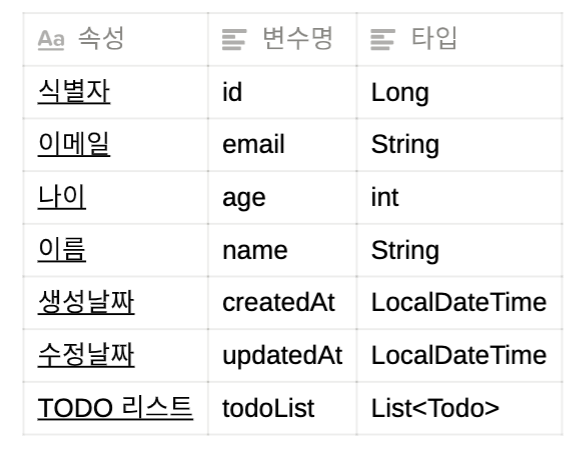
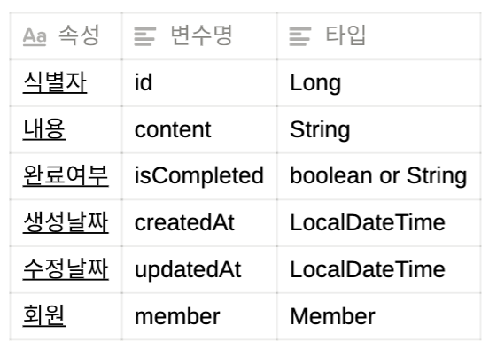
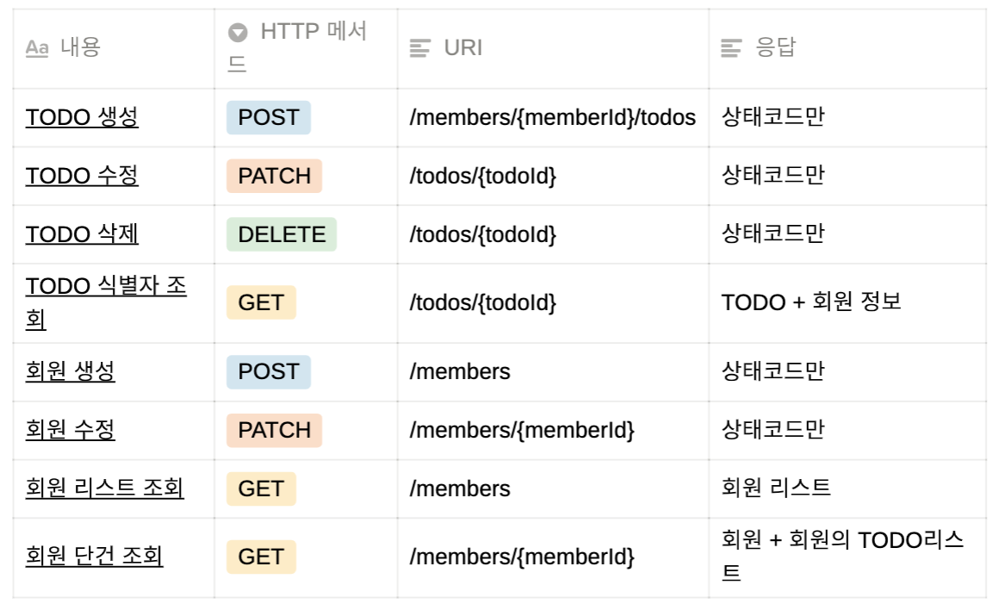

# 회원 TODO-list API 구현하기

- deadline 22.05.30
- DB 생성 및 연결, 연관 관계 설정
- API
    - `POST` : 회원 생성
    - `GET` : 회원 목록 조회
    - `PATCH` : 회원 정보 수정
    - `POST` : Todo 생성
    - `GET` : 회원 + 회원의 Todo리스트 조회
    - `PATCH` : Todo 수정
    - `DELETE` : Todo 삭제
    - `GET` : Todo 식별자 조회( TODO + 회원 정보)

- Dependencies
    - Spring DevTools, Lombok, Spring Web, Spring Data JPA, H2 DB(or MySQL)
    - express, sequalize, morgan 등등
- 회원은 N개의 TODO를 가질 수 있다.
- 회원 → TODO 도 조회가 가능해야하고 TODO → 회원의 조회도 가능해야 한다.

### 요구사항
- 회원 생성 기능
    - 회원 이메일 중복 체크 및 에러처리
- 회원 수정 기능
    - 회원의 나이 및 이름만 변경
- 회원 리스트 조회 기능 - 회원만
- 회원 단건 조회
    - 회원의 TODO 리스트까지 같이 조회 ( 일대다 조인 )
- todo 생성 기능
    - 어떤 회원의 TODO인지 구별이 가능해야 한다
      -> TODO에 외래키로 회원의 Id 가 필요
- todo 수정 기능 - 완료여부만 변경
- todo 삭제 기능
- todo 를 식별자를 이용하여 조회 기능 ( 회원까지 같이 조회 다대일 )

### 회원의 구성

### To-Do 의 구성

### API
